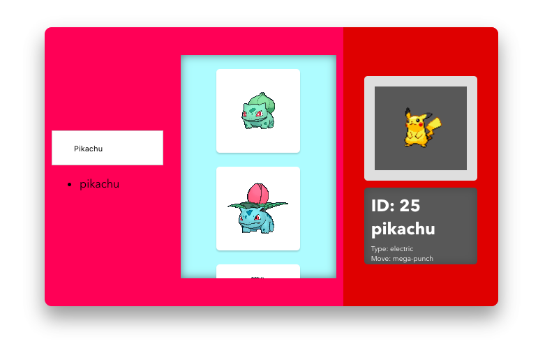

# Pokedex by Carlos Robles

# To get Started

To get the frontend running locally:

Clone this repo
npm install to install all req'd dependencies
npm start to start the local server (this project uses create-react-app)

# Requerimientos adicionales (Usar en Google Chrome)

Para que funcione localmente tienes que instalar la extensión para google chrome : enable cross origin, la url es:
https://chrome.google.com/webstore/detail/allow-control-allow-origi/nlfbmbojpeacfghkpbjhddihlkkiljbi

